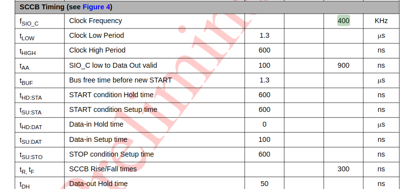

# SCCB
SCCB의 역할: OV7670의 동작모드를 설정하는 역할을 한다.
예를 들면, 이미지 해상도 설정, 출력포맷(RGB565), 프레임속도 를 설정하는 역할을 함

> 이때까지는 이 역할을 stm32가 해줬음

이제 독립시켜야 함
---

## SCCB Timing
SCCB는 I2C와 비슷.
OV7670 document에 다음과 같이 SCCB Timing 관련 표가 있다.  
  

### SIO_C(SCL) 만들기
  
SCL (SIO_C) 의 clk frequency는 400KHZ로 맞춰주어야 한다.

100MHZ CLK 을 400KHZ로 만드려면 : 250 count 세면 됨
