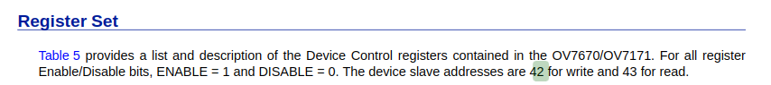

# SCCB
SCCB의 역할: OV7670의 동작모드를 설정하는 역할을 한다.
예를 들면, 이미지 해상도 설정, 출력포맷(RGB565), 프레임속도 를 설정하는 역할을 함

> 이때까지는 이 역할을 stm32가 해줬음

이제 독립시켜야 함

카메라를 설정하기 위해 OV7670의 00~C9 까지의 레지스터를 설정해 주어야함.  
[설정 값이 있는 rom code](./OV7670_config_rom.sv)

---  

## SCCB Timing
SCCB는 I2C와 비슷.
OV7670 document에 다음과 같이 SCCB Timing 관련 표가 있다.  
우리는 곧 마스터라고 생각하면됨. `SCL`과 `SDA`를 OV7670 모듈에 넣어주는 것

  

### 1. SIO_C(SCL) 만들기
**1) 400kHz tick 만들기**  
[tick 400kHz code](./tick_400kHz.sv)  
SCL (SIO_C) 의 clk frequency는 400KHZ로 맞춰주어야 한다.

100MHZ CLK 을 400KHZ로 만드려면 : 250 count 세면 됨

**2) 상황에 맞게 SCL 나가게 하기**
I2C에서 해봤듯이 start, stop, data 등 상태에서 정의되는 SCL 값이 다르다.
상황에 맞게 정의해주어야 함.

먼저 IDLE 상태 (통신 중이 아닐 때) SCL 은 `High`로 고정이다.

이거 하기 위해서는 상태 부터 정의해야함.

### 상태 정의
OV7670 레지스터는 카메라를 설정하기 위해 00~C9 까지의 레지스터를 설정해 주어야함.  
이를 위해 아래와 같은 상태머신을 구축할 것.

    IDLE -> START-> DATA -> STAY -> STOP

(1) IDLE  
START 신호 감지되면 -> START로 이동

> START 신호는 어떻게 줄건지?
    보통 버튼으로 주거나 아니면 reset이 인가되면 ov7670 register랑 뭔가 연계해서 하는 것 같음. 이건 나중에 생각할 것
    -> reset이 인가되면 자동으로 주는걸로 결정
    

**SCCB device ID**
OV7670 카메라 모듈 slave address는 '0x21' 이고, 따라서
Write Address는 0x42(0x21 << 1|0), READ address는 0x43(0x21 << 1|1)
